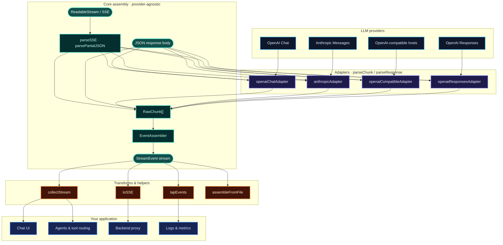
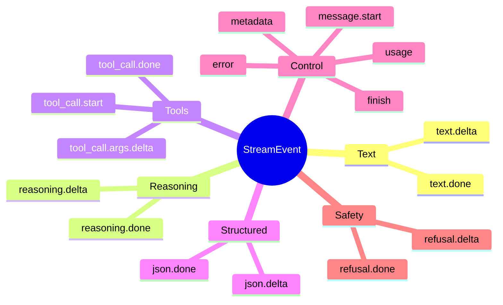

# llm-stream-assemble


[](https://github.com/01laky/llm-stream-assemble/actions/workflows/ci.yml)


A zero-dependency TypeScript library that normalizes LLM streaming responses — text, tool calls, reasoning, JSON, usage, errors, and non-streaming payloads — into unified events.

**Status:** Stable `1.0.0`. Core, OpenAI Chat, OpenAI-compatible, Anthropic Messages, OpenAI Responses adapters, transforms, replay helpers, and examples are production-ready. Pin semver ranges as usual and review [CHANGELOG.md](./CHANGELOG.md) before major upgrades.

> A zero-dependency TypeScript layer for assembling OpenAI, Anthropic, and compatible LLM streams into unified events for text, tool calls, reasoning, JSON, usage, errors, and non-streaming responses - so you can stop hand-rolling provider parsers and keep one clean, typed event model across LLM apps, agents, proxies, and backends.

## How it works

Raw provider bytes enter through a **thin adapter**, get assembled into **typed events**, and leave through the same transform layer whether you stream live, replay fixtures, or proxy to a browser.



Every adapter maps provider-specific fragments into the same **`StreamEvent`** union — one event model for streaming and non-streaming code paths:



**Design constraints:** adapters never accumulate cross-chunk state beyond id/index reconciliation; assembly, buffering, and `.done` emission live in core. No HTTP client, no tool execution, no UI — just the stream layer.

## Install

```bash
pnpm add llm-stream-assemble
# or npm install llm-stream-assemble
```

## Requirements

- Node.js 18+

## Documentation

- [Product & technical proposal](./docs/proposal.md)
- [Post-1.0 provider roadmap (proposal)](./docs/post-1.0-provider-roadmap.md)
- [Provider compatibility matrix](./docs/compatibility.md)
- [Adapter author guide](./docs/adapter-guide.md)

## Core Usage

The core pipeline works with any adapter that emits `RawChunk[]`, including the built-in OpenAI Chat, OpenAI-compatible, Anthropic Messages, and OpenAI Responses adapters:

```ts
import { assembleFromPayloads, type StreamAdapter } from "llm-stream-assemble";

const adapter: StreamAdapter = {
	parseChunk(raw) {
		const data = JSON.parse(raw) as { text?: string };
		return data.text ? [{ kind: "text-delta", text: data.text }] : [];
	},
};

for await (const event of assembleFromPayloads(payloads, adapter)) {
	if (event.type === "text.delta") process.stdout.write(event.text);
}
```

Assembly buffers completed text, reasoning, JSON, and tool-call arguments so it can emit final `.done` events. Use `maxBufferBytes` to cap those buffers for untrusted or unusually large streams.

## Quickstart

```ts
import { assembleStream, openaiChatAdapter } from "llm-stream-assemble";

for await (const event of assembleStream(response.body!, openaiChatAdapter())) {
	if (event.type === "text.delta") process.stdout.write(event.text);
}
```

## OpenAI Chat Usage

`openaiChatAdapter()` parses OpenAI Chat Completions payloads. Create one adapter instance per request/stream because it keeps minimal state for metadata and tool-call indexes.

```ts
import { assembleStream, openaiChatAdapter } from "llm-stream-assemble";

const response = await fetch("https://api.openai.com/v1/chat/completions", {
	method: "POST",
	headers: {
		Authorization: `Bearer ${process.env.OPENAI_API_KEY}`,
		"Content-Type": "application/json",
	},
	body: JSON.stringify({
		model: "gpt-4o-mini",
		messages,
		stream: true,
		stream_options: { include_usage: true },
	}),
});

for await (const event of assembleStream(response.body!, openaiChatAdapter())) {
	if (event.type === "text.delta") process.stdout.write(event.text);
}
```

Streaming usage requires `stream_options: { include_usage: true }` on the OpenAI request. JSON mode content is exposed by OpenAI as normal content deltas, so use `openaiChatAdapter({ jsonMode: true })` when you want content mapped to `json.*` events.

## OpenAI-Compatible Usage

`openaiCompatibleAdapter()` supports OpenAI-shaped Chat Completions APIs with best-effort provider presets. Create one adapter instance per request/stream.

```ts
import { assembleStream, openaiCompatibleAdapter } from "llm-stream-assemble";

const adapter = openaiCompatibleAdapter({
	provider: "openrouter",
});

for await (const event of assembleStream(response.body!, adapter)) {
	if (event.type === "text.delta") process.stdout.write(event.text);
}
```

Provider presets:

| Preset       | Intended hosts                | Notes                                                       |
| ------------ | ----------------------------- | ----------------------------------------------------------- |
| `generic`    | Any OpenAI-shaped API         | Loose defaults, best first try                              |
| `openrouter` | OpenRouter                    | Mostly OpenAI-shaped; provider-specific metadata may appear |
| `groq`       | Groq OpenAI-compatible API    | OpenAI-like; usage can vary by endpoint/model               |
| `ollama`     | Ollama `/v1/chat/completions` | Local host, metadata may be sparse                          |
| `lmstudio`   | LM Studio local server        | Local host, metadata/usage may be sparse                    |
| `together`   | Together AI                   | OpenAI-like, reasoning fields may vary                      |
| `fireworks`  | Fireworks AI                  | OpenAI-like, usage/details may vary                         |

Strict vs loose configuration:

```ts
// Loose default: good for local/open-source OpenAI-compatible hosts.
openaiCompatibleAdapter({ provider: "ollama" });

// Stricter mode: useful when unexpected payload shapes should fail fast.
openaiCompatibleAdapter({
	provider: "generic",
	allowMissingMetadata: false,
	looseErrorShape: false,
	useChoicePositionFallback: false,
});
```

Known limitations:

- Provider presets are fixture-tested and best-effort; CI does not call live provider APIs.
- Hosts can change OpenAI-compatible dialects without notice.
- Non-string reasoning payloads are skipped.
- Multi-choice terminal behavior is limited by the current core single terminal finish event.
- Missing tool ids are tolerated because core can synthesize stable ids by index.

## Anthropic Messages Usage

`anthropicAdapter()` parses Anthropic Messages streaming events and non-streaming responses. Create one adapter instance per request/stream.

```ts
import { anthropicAdapter, assembleStream } from "llm-stream-assemble";

for await (const event of assembleStream(response.body!, anthropicAdapter())) {
	if (event.type === "text.delta") process.stdout.write(event.text);
}
```

Anthropic tool calls are emitted from `tool_use` content blocks. Fine-grained tool input streaming is supported through `input_json_delta`; partial input may be invalid JSON until the block ends, and core handles those partial previews best-effort. Thinking blocks map to `reasoning.*` events with `variant: "detail"`.

## OpenAI Responses Usage

`openaiResponsesAdapter()` parses OpenAI Responses API streaming events and non-streaming response objects. It focuses on output text and function call argument streams; Realtime, audio, and multimodal binary output are out of scope.

```ts
import { assembleStream, openaiResponsesAdapter } from "llm-stream-assemble";

for await (const event of assembleStream(response.body!, openaiResponsesAdapter())) {
	if (event.type === "tool_call.args.delta") console.log(event.delta);
}
```

Use `openaiResponsesAdapter({ jsonMode: true })` to map output text to `json.*` events. Reasoning support is best-effort for string summary/detail fields. Create a new adapter instance per stream.

## Collecting a Stream

`collectStream()` materializes a full event stream into text, reasoning, refusals, JSON, tool calls, latest usage, and finish reason. It buffers full output in memory and aggregates multi-choice text in event order; it is not a per-choice collector and does not currently collect metadata.

```ts
import { collectStream } from "llm-stream-assemble";

const result = await collectStream(events);
console.log(result.text, result.toolCalls, result.finishReason);
```

## Tapping Events

`tapEvents()` lets you observe events for logging or metrics without changing the stream.

```ts
import { tapEvents } from "llm-stream-assemble";

for await (const event of tapEvents(events, (event) => console.debug(event.type))) {
	// consume normally
}
```

## Forwarding Unified SSE

`toSSE()` serializes unified `StreamEvent` objects as `data: <json>` SSE messages. It does not currently emit named SSE `event:` fields, and it emits unified event JSON rather than raw provider SSE.

```ts
import { toSSE } from "llm-stream-assemble";

return new Response(toSSE(events, { sanitizeErrors: true }), {
	headers: { "Content-Type": "text/event-stream" },
});
```

Use `sanitizeErrors: true` when forwarding events to browsers so raw provider internals are not exposed.

## Replaying Fixtures

`assembleFromFile()` is a Node/dev replay helper for local `.sse` and `.json` fixtures. It uses `node:fs/promises`, so avoid it in browser bundles; a dedicated browser/edge entry point can be added later if needed.

```ts
import { assembleFromFile, openaiChatAdapter } from "llm-stream-assemble";

for await (const event of assembleFromFile(
	"test/fixtures/openai-chat/text-basic.sse",
	openaiChatAdapter(),
)) {
	console.log(event);
}
```

## Examples

- `examples/node-fetch/openai-chat.ts`
- `examples/node-fetch/openai-compatible.ts`
- `examples/node-fetch/anthropic.ts`
- `examples/node-fetch/replay-fixture.ts`
- `examples/proxy-safety/web-standard-proxy.ts`
- `examples/proxy-safety/browser-client.ts`

Proxy safety:

- Use `toSSE(events, { sanitizeErrors: true })` for browser-facing streams.
- Use `tapEvents` for server-side observation and logging.
- Never forward raw provider errors or upstream non-OK response bodies to browsers.
- CORS headers are application-specific and intentionally omitted from the Web-standard example.

## Non-goals

- No HTTP client, auth, retries, or provider SDK wrapper.
- No agent loop, tool execution, memory, or persistence.
- No UI framework, React hooks, or browser components.
- No multimodal binary/audio/video parsing.

## Development

```bash
pnpm install
pnpm verify
```

Scripts:

| Command            | Description                            |
| ------------------ | -------------------------------------- |
| `pnpm verify`      | lint + typecheck + test + build        |
| `pnpm verify:deps` | fail if runtime dependencies are added |
| `pnpm test`        | Vitest smoke tests                     |
| `pnpm build`       | tsup → ESM + CJS + declarations        |

## Author

**Ladislav Kostolny** — [01laky@gmail.com](mailto:01laky@gmail.com) · [GitHub @01laky](https://github.com/01laky)

## License

MIT — see [LICENSE](./LICENSE). Copyright (c) 2026 Ladislav Kostolny.
