# Edge-case showcase

**Status:** Active guide — `1.5.0`

Concrete examples of what breaks when you treat LLM streams as plain text, and how `llm-stream-assemble` handles the **protocol layer**. For positioning vs other tools, see [comparison](./comparison.md).

---

## A) SSE mid-line split (protocol layer)

TCP reads do not respect SSE line boundaries:

```text
TCP read 1:  data: {"choices":[{"delta":{"content":"Hel
TCP read 2:  lo"}}]}
             ↑ naive concat or JSON.parse on read 1 fails
```

**What we do:** `parse-sse.ts` buffers bytes until a line terminator before yielding a payload.

**Proven in tests:** `test/parse-sse.test.ts` — **LSA-C04** (mid-line buffer), **LSA-C-EXT21** (CRLF split).

---

## B) Tool argument JSON partials (assembly layer)

Tool parameters stream as fragments — not one JSON object per chunk:

```text
tool_call.args.delta: "{"
tool_call.args.delta: "\"city\":"
tool_call.args.delta: "\"Paris\"}"
         ↓
tool_call.done → args: { "city": "Paris" }
```

**What we do:** `EventAssembler` accumulates args until `tool_call.done`, then parses JSON.

**Fixtures:** `test/fixtures/openai-chat/tool-single.sse` — covered by `test/openai-chat-tools.test.ts`.

**Anthropic variant:** fine-grained `input_json_delta` may be invalid JSON until the block ends — fixture `test/fixtures/anthropic/tool-use.sse`, tests **LSA-A\***.

---

## C) JSON mode streaming

Structured output streams as string deltas, not a parsed object:

```text
json.delta: "{\"na"
json.delta: "me\":"
json.delta: "\"John\"}"
         ↓
json.done → "{\"name\":\"John\"}"  (parse in your app)
```

**Fixture:** `test/fixtures/openai-chat/json-mode.sse`

Use `openaiChatAdapter({ jsonMode: true })` or the matching option on other adapters.

---

## D) UI layer — markdown fences (non-goal)

Model text can split markdown code fences across **text tokens**:

````text
text.delta: "```json\n{"
text.delta: "\"a\":1}\n```"
````

That is **rendering** concern — feed `text.delta` into your markdown UI. This library does **not** parse or reassemble markdown/XML fences inside model output. See README [Non-goals](../README.md#non-goals).

---

## E) DIY vs `assembleStream`

| DIY (`+=` / manual reader)            | `llm-stream-assemble`                                        |
| ------------------------------------- | ------------------------------------------------------------ |
| `reader.read()` loop + string concat  | `for await (const event of assembleStream(body, adapter))`   |
| Hope each chunk is valid JSON         | Adapter parses each SSE `data:` payload                      |
| Manual tool JSON stitch               | `tool_call.args.delta` → `tool_call.done`                    |
| Separate stream vs non-stream parsers | Same `StreamEvent` via `assembleStream` / `assembleResponse` |
| Re-test every provider dialect        | Built-in adapters + golden fixtures                          |

For framework-level comparison (AI SDK, provider SDKs), see [comparison.md](./comparison.md).

---

## F) Prove it on a fixture (no API key)

Replay a checked-in golden fixture locally:

```ts
import { assembleFromFile, openaiChatAdapter } from "llm-stream-assemble";

for await (const event of assembleFromFile(
	"test/fixtures/openai-chat/tool-single.sse",
	openaiChatAdapter(),
)) {
	if (event.type === "tool_call.done") console.log(event.name, event.args);
}
```

Node/dev helper only (`node:fs`); see README Transforms and [`examples/node-fetch/replay-fixture.ts`](../examples/node-fetch/replay-fixture.ts).

---

## G) Fixture and test provenance

| Topic                        | Fixture / test                                                                                                                                                                                     |
| ---------------------------- | -------------------------------------------------------------------------------------------------------------------------------------------------------------------------------------------------- |
| SSE mid-line split           | **LSA-C04**, **LSA-C-EXT21** — `test/parse-sse.test.ts`                                                                                                                                            |
| Tool JSON partials           | `test/fixtures/openai-chat/tool-single.sse` — `test/openai-chat-tools.test.ts`                                                                                                                     |
| Anthropic partial tool input | `test/fixtures/anthropic/tool-use.sse`                                                                                                                                                             |
| JSON mode                    | `test/fixtures/openai-chat/json-mode.sse`                                                                                                                                                          |
| O(n) assembly smoke          | **LSA-C52** — `test/performance-smoke.test.ts`; local repro: `pnpm bench:smoke`                                                                                                                    |
| Cohere tool-plan reasoning   | `test/fixtures/cohere/tool-plan.jsonl` — **LSA-CO20**, **LSA-CO03**                                                                                                                                |
| Cohere citation metadata     | `test/fixtures/cohere/citations-stream.jsonl` — **LSA-CO20b**, **LSA-CO07**                                                                                                                        |
| Cohere late tool id          | `test/fixtures/cohere/tool-late-id.jsonl` — **LSA-CO77**, **LSA-CO78** — placeholder `cohere:tool:{index}` on start; real id on delta; possible closing `tool_call.done` for placeholder at finish |

---

## H) Post-finish assembler drop (lifecycle layer)

After `finish`, providers may still emit usage-only or trace metadata. The assembler **drops further chunks** once a terminal finish is processed:

```text
text.delta → finish (stop) → metadata { trace }  ← dropped at assembly layer
```

**What we do:** `EventAssembler` ignores adapter output after the first terminal `finish` per stream.

**Proven in tests:** **LSA-B71**, **LSA-A41**, **LSA-G67**, **LSA-R40**, **LSA-X58**–**X62** — `test/cross-adapter-assembler-edge.test.ts` and per-adapter edge-case suites.

---

## Mental model



```text
SSE bytes → parse-sse (line buffer) → adapter (per payload) → EventAssembler → StreamEvent
```

See also README [Architecture](../README.md#architecture) and `docs/img/assembler-lifecycle.svg`.
