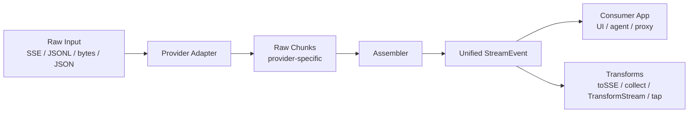

# llm-stream-assemble — Product & Technical Proposal

**Status:** Draft (reviewed)  
**Version:** 0.1 (planned)  
**Last updated:** 2026-05-25

> Note: This proposal is historical. See the README and docs/compatibility.md for
> current implementation status.

---

## Summary

`llm-stream-assemble` is a small, provider-agnostic npm library that **assembles and normalizes LLM streaming and non-streaming responses** into a unified event format.

It sits between raw provider payloads (SSE / JSONL / bytes / JSON from OpenAI, Anthropic, and OpenAI-compatible APIs) and application code (UI, agents, proxies). It does **not** make HTTP requests, execute tools, manage conversation memory, or ship UI components.

**Positioning:**

> _The missing stream assembly layer between LLM providers and your app._

**Core promise:**

- **Zero runtime dependencies** in core
- **One event model** for streaming and non-streaming code paths
- **Golden-file testable** provider adapters

**One-line flow (streaming):**

```
raw provider stream → adapter → assembler → unified StreamEvent stream
```

**One-line flow (non-streaming):**

```
provider JSON response → adapter → assembler → unified StreamEvent[] (same shape)
```

---

## Problem

Teams building chat, agents, or voice pipelines repeatedly implement the same glue code:

1. **SSE / JSONL parsing** — each provider formats streams differently
2. **Text delta accumulation** — partial tokens must be stitched into complete messages
3. **Tool-call argument assembly** — function arguments arrive as fragmented JSON over many chunks
4. **Structured JSON streaming** — JSON mode / schema outputs stream like tool args but are not tool calls
5. **Reasoning vs. content separation** — thinking blocks (Claude, DeepSeek R1, OpenAI reasoning models) must not leak into user-visible output
6. **Provider error handling** — malformed or mid-stream error payloads need graceful recovery
7. **Stream lifecycle** — abort, incomplete responses, and terminal finish reasons must be handled consistently
8. **Proxy safety** — forwarding raw provider errors to browsers can leak internal details
9. **Dual code paths** — teams maintain separate parsers for `stream: true` vs `stream: false`

Existing solutions (LangChain, Vercel AI SDK, `@node-llm/core`, etc.) address this inside **large frameworks**. Many teams only need the stream normalization primitive and prefer to keep their own fetch layer, agent loop, and persistence.

---

## Solution

A focused TypeScript library with a single responsibility:

| In scope                                                 | Out of scope                        |
| -------------------------------------------------------- | ----------------------------------- |
| Parse provider-specific stream chunks and JSON responses | HTTP client, auth, retries          |
| Assemble text, tool calls, reasoning, structured JSON    | Agent loop, tool execution          |
| Emit unified `StreamEvent`s (stream + non-stream)        | Memory / persistence                |
| Partial JSON for live preview                            | Billing, telemetry                  |
| Provider adapters (pluggable)                            | React hooks, UI components          |
| Transforms: `toSSE`, `collectStream`, `TransformStream`  | Multimodal audio/video streams (v1) |
| Type-safe event helpers                                  | Optional Zod validation (peer dep)  |
| Proxy error sanitization option                          | Logprobs (future)                   |

### Target users

- Backend teams proxying LLM streams to a frontend
- Agent builders who want a thin stream layer on top of plain `fetch()`
- Edge/serverless developers using Web `TransformStream` pipelines
- Anyone switching providers without rewriting SSE parsers

### Differentiation

| Existing approach    | Gap                                              |
| -------------------- | ------------------------------------------------ |
| LangChain / AI SDK   | Full stack; hard to extract only stream assembly |
| Provider SDKs        | Vendor-specific; no unified event model          |
| `@tashiscool/stream` | Broader scope (mux, cursors); less known         |

`llm-stream-assemble` should be the **primitive**:

- **Zero runtime dependencies** in core (optional peer deps for validation / AI SDK mappers only)
- Tree-shakeable adapters via subpath exports
- Golden-file testable
- Same event model for streaming and non-streaming
- Usable with plain `fetch()`, Hono, Express, Cloudflare Workers

---

## Dependency Policy

| Package area       | Runtime dependencies                                                          |
| ------------------ | ----------------------------------------------------------------------------- |
| **Core**           | **0** — SSE parser, assembler, event types, helpers                           |
| **Adapters**       | **0** — included in main package, no SDK imports                              |
| **Optional peers** | `zod` (strict tool-arg validation), `@ai-sdk/provider` (interop mapper, v0.2) |

This is a primary selling point and must be preserved in CI (dependency audit gate).

---

## Architecture



### Layers

| Layer          | Responsibility                                                                                           |
| -------------- | -------------------------------------------------------------------------------------------------------- |
| **Core**       | Event types, `assembleStream()`, `assembleResponse()`, SSE parser, partial JSON, assembler state machine |
| **Adapters**   | Map provider JSON → internal raw chunks (stream + non-stream)                                            |
| **Assemblers** | Accumulate deltas into complete text, tool args, reasoning, structured JSON                              |
| **Transforms** | `toSSE()`, `collectStream()`, `createAssemblyTransform()`, `tapEvents()`, AI SDK mapper (v0.2)           |
| **Helpers**    | `matchEvent()`, type guards, `assembleFromFile()` for fixture replay                                     |

### Pipeline (streaming)

```
ReadableStream<Uint8Array>
  → parseSSE()            // bytes → SSE data payloads
  → adapter.parseChunk()  // provider JSON → RawChunk[]
  → assembler             // RawChunk[] → StreamEvent
```

### Pipeline (non-streaming)

```
provider JSON object
  → adapter.parseResponse()  // or reuse parseChunk on synthetic payloads
  → assembler
  → StreamEvent[]            // same event types as streaming
```

Adapters parse provider JSON into raw chunks. They do **not** assemble final messages or complete tool arguments. Cross-chunk accumulation lives in core. Adapters may keep minimal parse context (e.g. current content block index, choice index) when required by the provider format.

### Repository layout (v0.1)

Single npm package; split into a monorepo only if adapters grow significantly.

```
llm-stream-assemble/
├── src/
│   ├── index.ts
│   ├── core/
│   ├── adapters/
│   │   ├── openai-chat.ts
│   │   ├── openai-compatible.ts   # v0.1 — OpenRouter, Groq, Ollama, etc.
│   │   ├── openai-responses.ts    # v0.2 unless time allows
│   │   └── anthropic.ts
│   ├── transforms/
│   └── helpers/
├── test/
│   ├── fixtures/                  # .sse / .json dumps, no API keys
│   └── benchmarks/                # optional throughput bench
├── examples/
│   ├── node-fetch/
│   └── express-proxy/
├── docs/
│   ├── proposal.md
│   ├── compatibility.md           # provider matrix (living doc)
│   └── adapter-guide.md           # how to add an adapter
├── LICENSE
├── CONTRIBUTING.md
└── README.md
```

---

## Unified Event Model

All providers normalize to the same `StreamEvent` union:

```ts
type StreamEvent =
	| { type: "message.start"; id?: string; choiceIndex?: number }
	| { type: "metadata"; model?: string; responseId?: string; created?: number; raw?: unknown }
	| { type: "text.delta"; text: string; choiceIndex?: number }
	| { type: "text.done"; text: string; choiceIndex?: number }
	| { type: "reasoning.delta"; text: string; variant?: "summary" | "detail" }
	| { type: "reasoning.done"; text: string; variant?: "summary" | "detail" }
	| { type: "refusal.delta"; text: string }
	| { type: "refusal.done"; text: string }
	| { type: "json.delta"; delta: string; partial?: unknown }
	| { type: "json.done"; value: unknown }
	| { type: "tool_call.start"; id: string; name: string; index?: number; choiceIndex?: number }
	| { type: "tool_call.args.delta"; id: string; delta: string; partial?: unknown }
	| { type: "tool_call.done"; id: string; name: string; args: unknown }
	| {
			type: "usage";
			inputTokens?: number;
			outputTokens?: number;
			reasoningTokens?: number;
			raw?: unknown;
	  }
	| {
			type: "finish";
			reason:
				| "stop"
				| "tool_calls"
				| "length"
				| "content_filter"
				| "error"
				| "incomplete"
				| "aborted";
			choiceIndex?: number;
	  }
	| { type: "error"; error: Error; recoverable?: boolean; sanitized?: string };
```

### Event ordering contract

For each logical unit, consumers can rely on:

- **Text:** `text.delta` (zero or more) → `text.done`
- **Reasoning:** `reasoning.delta` (zero or more) → `reasoning.done`
- **Refusal:** `refusal.delta` (zero or more) → `refusal.done`
- **Structured JSON:** `json.delta` (zero or more) → `json.done`
- **Tool call:** `tool_call.start` → `tool_call.args.delta` (zero or more) → `tool_call.done`
- **Stream:** exactly one terminal `finish` event per consumed stream (or per `choiceIndex` when documented), then iteration ends

### Design notes

- `tool_call.args.delta.partial` and `json.delta.partial` are best-effort live previews; may be invalid JSON (especially Anthropic fine-grained streaming).
- OpenAI may send tool calls keyed by `index` before `id` arrives; the assembler reconciles by index until a stable id is known.
- `choiceIndex` is set when the provider streams multiple completions (`n > 1`).
- `usage` for OpenAI Chat Completions requires `stream_options: { include_usage: true }` on the request (documented in README, not enforced by the library).
- `finish.reason: "incomplete"` when the connection drops before a terminal provider marker (`[DONE]`, `message_stop`, etc.).
- `finish.reason: "aborted"` when the consumer aborts via `AbortSignal`.
- `metadata` may arrive early (`message.start`, `message_start`) — consumers should not assume it comes last.
- Legacy OpenAI `function_call` (pre-`tool_calls`) maps to the same `tool_call.*` events for backward compatibility.

---

## Public API (v0.1)

### Core — streaming

```ts
function assembleStream(
	source: ReadableStream<Uint8Array> | AsyncIterable<string>,
	adapter: StreamAdapter,
	options?: AssembleOptions,
): AsyncIterable<StreamEvent>;

function assembleFromPayloads(
	payloads: AsyncIterable<string>,
	adapter: StreamAdapter,
	options?: AssembleOptions,
): AsyncIterable<StreamEvent>;

function createAssemblyTransform(
	adapter: StreamAdapter,
	options?: AssembleOptions,
): TransformStream<Uint8Array, StreamEvent>;

function parseSSE(
	source: ReadableStream<Uint8Array> | AsyncIterable<string>,
): AsyncIterable<string>;

function parsePartialJSON(input: string): {
	value?: unknown;
	complete: boolean;
};

interface StreamAdapter {
	parseChunk(raw: string): RawChunk[];
	parseResponse?(body: unknown): RawChunk[]; // non-streaming JSON
}

interface AssembleOptions {
	recoverMalformed?: boolean;
	signal?: AbortSignal;
	sanitizeErrors?: boolean; // strip provider internals from error events / toSSE output
	strictToolArgs?: boolean; // throw on invalid JSON at tool_call.done (default: false)
}
```

### Core — non-streaming

```ts
function assembleResponse(
	body: unknown,
	adapter: StreamAdapter,
	options?: AssembleOptions,
): StreamEvent[];
```

Same event types as streaming — enables one consumer code path for UI and batch/agent logic.

### Transforms (v0.1)

```ts
function collectStream(events: AsyncIterable<StreamEvent>): Promise<{
	text: string;
	reasoning: string;
	refusals: string;
	json: unknown;
	toolCalls: Array<{ id: string; name: string; args: unknown }>;
	usage?: StreamEvent & { type: "usage" };
	finishReason?: StreamEvent & { type: "finish" };
}>;

function toSSE(
	events: AsyncIterable<StreamEvent>,
	options?: { sanitizeErrors?: boolean },
): ReadableStream<Uint8Array>;

function tapEvents(
	events: AsyncIterable<StreamEvent>,
	onEvent: (event: StreamEvent) => void,
): AsyncIterable<StreamEvent>;
```

### Helpers — type-safe consumption (v0.1)

```ts
function isTextDelta(event: StreamEvent): event is Extract<StreamEvent, { type: "text.delta" }>;
function isToolCallDone(
	event: StreamEvent,
): event is Extract<StreamEvent, { type: "tool_call.done" }>;
// ... guards for each event type

function matchEvent<R>(
	event: StreamEvent,
	handlers: Partial<{ [K in StreamEvent["type"]]: (e: Extract<StreamEvent, { type: K }>) => R }>,
): R | undefined;
```

Zero runtime cost for guards; `matchEvent` is a thin switch helper.

### Debug / replay

```ts
function assembleFromFile(
	path: string,
	adapter: StreamAdapter,
	options?: AssembleOptions & { format?: "sse" | "json" },
): AsyncIterable<StreamEvent>;
```

Replays captured production dumps during incident debugging (local/dev only).

### Adapters (exported factories)

```ts
openaiChatAdapter(): StreamAdapter;
openaiCompatibleAdapter(): StreamAdapter;   // v0.1 — OpenRouter, Groq, Together, Ollama, etc.
anthropicAdapter(): StreamAdapter;
openaiResponsesAdapter(): StreamAdapter;    // v0.2 unless time allows
```

### Subpath exports (tree-shaking)

```json
{
	"exports": {
		".": "./dist/index.js",
		"./core": "./dist/core.js",
		"./adapters/openai-chat": "./dist/adapters/openai-chat.js",
		"./adapters/openai-compatible": "./dist/adapters/openai-compatible.js",
		"./adapters/anthropic": "./dist/adapters/anthropic.js"
	}
}
```

### Example usage (streaming)

```ts
import { assembleStream, openaiChatAdapter, matchEvent } from "llm-stream-assemble";

const response = await fetch("https://api.openai.com/v1/chat/completions", {
	method: "POST",
	signal: controller.signal,
	headers: {
		Authorization: `Bearer ${process.env.OPENAI_API_KEY}`,
		"Content-Type": "application/json",
	},
	body: JSON.stringify({
		model: "gpt-4o",
		messages,
		tools,
		stream: true,
		stream_options: { include_usage: true },
	}),
});

for await (const event of assembleStream(response.body!, openaiChatAdapter(), {
	signal: controller.signal,
	sanitizeErrors: true,
})) {
	matchEvent(event, {
		"text.delta": (e) => process.stdout.write(e.text),
		"tool_call.args.delta": (e) => updateToolUI(e.id, e.delta),
		"tool_call.done": (e) => queueToolExecution(e.name, e.args),
		finish: (e) => console.log("done:", e.reason),
	});
}
```

### Example usage (non-streaming)

```ts
import { assembleResponse, collectStream, anthropicAdapter } from "llm-stream-assemble";

const response = await fetch("https://api.anthropic.com/v1/messages", {
	/* stream: false */
});
const body = await response.json();
const events = assembleResponse(body, anthropicAdapter());
const result = await collectStream(
	(async function* () {
		for (const e of events) yield e;
	})(),
);
```

---

## Provider Adapters

### OpenAI Chat Completions (required, v0.1)

Handle:

- `choices[].delta.content`
- `choices[].delta.tool_calls[]` — `index`, `id`, `function.name`, `function.arguments`
- Legacy `choices[].delta.function_call` → map to `tool_call.*`
- `choices[].delta.refusal` → `refusal.*`
- `finish_reason` including `content_filter`, `length`, `tool_calls`, `stop`
- Multiple choices (`n > 1`) via `choiceIndex` on events
- `usage` on final chunk when `stream_options.include_usage` is set
- Reasoning tokens / summary where present (o-series models) → `reasoning.*` with `variant`
- Provider `error` objects in SSE payloads
- Structured / JSON mode streamed content → `json.*` when not wrapped as tool calls

### OpenAI-compatible generic adapter (required, v0.1)

A single adapter for any API that copies the OpenAI Chat Completions SSE/JSON shape:

- OpenRouter, Groq, Together, Fireworks, LM Studio, Ollama (`/v1/chat/completions`), etc.
- Reuses OpenAI parser with optional dialect flags if a provider deviates slightly (document known quirks in `docs/compatibility.md`)

High leverage — covers the majority of integrations without per-vendor code.

### Anthropic Messages (required, v0.1)

Handle:

- `message_start` / `message_delta` / `message_stop`
- `content_block_start` / `content_block_delta` / `content_block_stop`
- `tool_use` blocks → `tool_call.*` events
- `thinking` / extended thinking → `reasoning.*` events (`variant: "detail"`)
- Refusal blocks → `refusal.*`
- Provider `error` event type
- Structured outputs streamed via tool schema → `json.*` or `tool_call.*` depending on mapping (document chosen convention)

Fine-grained tool input streaming (document in README):

- **Current API:** `eager_input_streaming: true` on tools when `stream: true`
- **Legacy / Bedrock:** beta header `anthropic-beta: fine-grained-tool-streaming-2025-05-14` or `anthropic_beta` array
- Partial tool input may be **invalid JSON** until complete — core must tolerate this

### OpenAI Responses API (v0.2)

Handle:

- `response.output_item.added`
- `response.function_call_arguments.delta`
- `response.function_call_arguments.done`

Defer from v0.1 unless time allows.

---

## Provider Compatibility Matrix

Living document at `docs/compatibility.md`, summarized in README:

| Provider / API          | Adapter                   | Text | Tools | Reasoning | Refusal | JSON stream | Usage | Multi-choice | Notes                                                                              |
| ----------------------- | ------------------------- | ---- | ----- | --------- | ------- | ----------- | ----- | ------------ | ---------------------------------------------------------------------------------- |
| OpenAI Chat Completions | `openaiChatAdapter`       | ✅   | ✅    | ✅        | ✅      | ✅          | ✅¹   | ✅           | ¹needs `stream_options.include_usage`                                              |
| OpenAI-compatible       | `openaiCompatibleAdapter` | ✅   | ✅    | ⚠️        | ⚠️      | ⚠️          | ⚠️    | ⚠️           | Provider-dependent; quirks documented per host                                     |
| Anthropic Messages      | `anthropicAdapter`        | ✅   | ✅    | ✅        | ✅      | ✅          | ✅    | —            | `eager_input_streaming` recommended                                                |
| OpenAI Responses        | `openaiResponsesAdapter`  | —    | ✅    | —         | —       | —           | —     | —            | v0.2                                                                               |
| Gemini                  | `geminiAdapter`           | ✅   | ✅    | ✅        | ✅      | ✅          | ✅    | partial      | Google AI **1.1.0**; Vertex **1.5.5**; edge depth **1.5.6** / ID hygiene **1.5.7** |

Legend: ✅ supported · ⚠️ best-effort / provider-dependent · — not applicable or not yet implemented

---

## Error & Security Policy (Proxy Use Case)

When used as an Express/Hono proxy (`examples/express-proxy`), raw provider errors must not leak stack traces, internal URLs, or API key hints to browser clients.

### Rules

- `assembleStream(..., { sanitizeErrors: true })` replaces `error.error.message` with a generic client-safe string; full error logged server-side only.
- `toSSE(..., { sanitizeErrors: true })` never forwards raw provider JSON error blobs to the client.
- Document recommended pattern: log full event with `tapEvents()`, forward sanitized SSE to browser.
- Provider `error` events are always emitted — consumers decide what to expose.

---

## Performance & Runtime Behavior

### Backpressure

- `assembleStream` must respect consumer speed when built on `ReadableStream` (use native piping / TransformStream correctly).
- Do not buffer unbounded event objects — only accumulated string state required for assembly.

### Memory

- Text, tool args, reasoning, and JSON buffers grow with response size — inherent to assembly.
- Document this explicitly; recommend `collectStream` only when full materialization is intended.

### Runtime compatibility matrix (test in CI)

| Runtime            | Target        | Notes                                   |
| ------------------ | ------------- | --------------------------------------- |
| Node 18+           | ✅ primary    | LTS versions 18, 20, 22 in CI           |
| Bun                | ⚠️ smoke      | ReadableStream compatibility smoke test |
| Deno               | ⚠️ smoke      | Import npm: specifiers                  |
| Cloudflare Workers | ⚠️ smoke      | TransformStream + fetch proxy           |
| Browser            | ⚠️ documented | If bundle size < 10 KB gzip for core    |

### Benchmark (informational CI job)

- Fixture: 100k small SSE chunks
- Measure: throughput (chunks/sec), allocs if feasible
- Publish result in CI log / README badge — not a hard gate initially

---

## Adapter Author Guide

Document at `docs/adapter-guide.md`. Summary:

1. **Capture fixtures** — redacted `.sse` or `.json` files under `test/fixtures/<adapter>/`
2. **Implement `parseChunk`** — one SSE `data:` payload → `RawChunk[]`; no cross-chunk assembly
3. **Implement `parseResponse`** (optional) — non-streaming JSON → same `RawChunk[]`
4. **Golden test** — fixture in → expected `StreamEvent[]` snapshot
5. **Edge cases checklist** — empty deltas, unicode, parallel tools, index→id, incomplete stream
6. **Update `docs/compatibility.md`** — add row with feature flags
7. **PR template** — require fixture + golden test for any adapter change

Community adapters (Gemini, Bedrock) can follow this guide without maintainer involvement in core design.

---

## Roadmap

### v0.1 — Foundation (expanded)

**Goal:** Ship a production-grade primitive — not a minimal toy.

| Area       | Deliverable                                                                                        |
| ---------- | -------------------------------------------------------------------------------------------------- |
| Core       | SSE parser, assemblers, partial JSON, `assembleStream`, `assembleResponse`, `assembleFromPayloads` |
| Core       | `createAssemblyTransform`, `AbortSignal` support, incomplete/aborted finish reasons                |
| Adapters   | OpenAI Chat, **OpenAI-compatible**, Anthropic Messages                                             |
| Transforms | `collectStream`, `toSSE` (lite), `tapEvents`                                                       |
| Helpers    | Type guards, `matchEvent`                                                                          |
| Events     | metadata, refusal, json stream, choiceIndex, extended finish reasons                               |
| Examples   | `node-fetch` CLI, `express-proxy` with sanitized errors                                            |
| Docs       | README, `docs/compatibility.md`, `docs/adapter-guide.md`, CONTRIBUTING.md, LICENSE                 |
| Quality    | Golden + unit tests; CI; optional benchmark job; bundle size < 5 KB gzip (core)                    |
| OSS        | Bundlephobia badge in README; runtime smoke matrix                                                 |

**Deferred from v0.1:** OpenAI Responses adapter, Gemini, Bedrock, multiplex, AI SDK mapper, stream resume/cursors, optional Zod peer validation.

**Estimated effort:** 8–12 days part-time (expanded scope).

### v0.2 — Ecosystem

- OpenAI Responses adapter
- Gemini adapter
- AI SDK / `@ai-sdk/provider` compatibility mapper
- Stream multiplex and resume / cursor support
- Optional `zod` peer for strict `tool_call.done` / `json.done` validation
- Citations and grounding shipped in **1.6.0** as additive `citation` / `grounding` events
- Logprobs (if demand)
- Split into monorepo packages if adapter count warrants it
- Browser bundle audit and dedicated edge entry point

---

## Testing Strategy

### Principles

- **Fixtures over live API in CI** — checked-in `.sse` / `.json` dumps; never commit API keys
- **Golden tests** — raw fixture in → expected `StreamEvent[]` out; clear diffs when providers change
- **Live tests optional** — gated behind `OPENAI_API_KEY` / `ANTHROPIC_API_KEY`, run locally or in a secrets-enabled CI job
- **Zero-dependency gate** — CI fails if core gains unexpected runtime dependencies

### Coverage areas

| Area           | Examples                                                                          |
| -------------- | --------------------------------------------------------------------------------- |
| SSE parser     | Multi-line `data:`, `[DONE]`, chunk split mid-line                                |
| Text assembler | Unicode, empty deltas, delta → done, multi-choice                                 |
| Tool assembler | Parallel tools, 50+ arg chunks, index → id reconciliation, legacy `function_call` |
| JSON assembler | Structured output streaming, invalid partial fragments                            |
| Partial JSON   | Incomplete strings, nested objects, invalid Anthropic fragments                   |
| Non-streaming  | `assembleResponse` parity with streaming fixtures                                 |
| Transforms     | `collectStream`, `toSSE`, `createAssemblyTransform`                               |
| Error handling | Malformed JSON, `sanitizeErrors`, `recoverMalformed`                              |
| Lifecycle      | AbortSignal, incomplete stream (no terminal marker)                               |
| Adapters       | Provider-specific golden fixtures per adapter                                     |

### Manual QA

- Stream text without dropped characters
- Assemble large tool args (10k+ chars)
- Abort mid-stream → `finish.reason: "aborted"`, no hang
- Proxy example does not leak provider error internals to client
- Node 18, 20, 22; Bun smoke

---

## Tooling

| Tool              | Purpose                              |
| ----------------- | ------------------------------------ |
| TypeScript 5.x    | Implementation + types               |
| tsup              | ESM + CJS + `.d.ts`, subpath exports |
| Vitest            | Unit + golden tests                  |
| ESLint + Prettier | Lint / format                        |
| pnpm              | Package management                   |

### Package metadata (v0.1)

```json
{
	"name": "llm-stream-assemble",
	"version": "0.1.0",
	"type": "module",
	"engines": { "node": ">=18" },
	"sideEffects": false,
	"license": "MIT"
}
```

**npm name:** `llm-stream-assemble` — available on npm as of 2026-05-25.

**Runtime target:** Node 18+ primary; Web Streams (`TransformStream`, `ReadableStream`) for edge; document browser/edge compatibility explicitly.

---

## Open Source Quality Checklist

Before npm publish:

| Item                    | Purpose                                     |
| ----------------------- | ------------------------------------------- |
| `LICENSE` (MIT)         | Legal clarity                               |
| `CONTRIBUTING.md`       | Points to adapter guide + test requirements |
| `docs/compatibility.md` | Living provider matrix                      |
| `docs/adapter-guide.md` | Community adapter onboarding                |
| Bundlephobia badge      | Prove < 5 KB gzip core claim                |
| Benchmark CI job        | Throughput transparency                     |
| Runtime smoke matrix    | Node + Bun + Workers documented             |
| CHANGELOG (no dates)    | Version-only entries per project convention |

---

## Publishing Plan

Publish only when explicitly requested. Before first release:

1. All fixture-based tests green
2. README with install, quickstart, compatibility matrix link, non-goals
3. CHANGELOG entry for `0.1.0`
4. MIT LICENSE file in repo root
5. `files: ["dist"]`, correct `exports` map with subpaths
6. Core bundle target: **< 5 KB gzip**
7. Zero runtime dependencies verified in CI

**First publish version:** `0.1.0`  
**Post-release:** Git tag, GitHub Release notes, monitor issues for adapter requests.

---

## Decisions

| #   | Decision          | Choice                                              | Rationale                                         |
| --- | ----------------- | --------------------------------------------------- | ------------------------------------------------- |
| 1   | Package structure | Single package for v0.1                             | Faster to ship; split at v0.2 if needed           |
| 2   | v0.1 adapters     | OpenAI Chat + **OpenAI-compatible** + Anthropic     | Maximum reach with minimal code                   |
| 3   | Non-streaming API | `assembleResponse` in v0.1                          | One event model for all code paths                |
| 4   | Transforms        | `collectStream`, `toSSE`, `TransformStream` in v0.1 | Production proxy + edge use cases                 |
| 5   | Responses API     | v0.2                                                | Newer API; lower priority than compatible adapter |
| 6   | Runtime           | Node 18+ primary, Web Streams for edge              | Matches fetch/Workers patterns                    |
| 7   | npm name          | `llm-stream-assemble`                               | Available, descriptive                            |
| 8   | License           | MIT                                                 | Standard for OSS npm libraries                    |
| 9   | CI live tests     | Fixtures only by default                            | No secrets required for contributors              |
| 10  | Core dependencies | **Zero runtime deps**                               | Primary differentiator                            |
| 11  | Proxy errors      | `sanitizeErrors` opt-in                             | Prevent provider leak to browsers                 |

Record any changes to these decisions in README when implementation starts.

---

## Risks & Mitigations

| Risk                                         | Mitigation                                                                |
| -------------------------------------------- | ------------------------------------------------------------------------- |
| Provider changes SSE format                  | Golden tests; semver minor for adapter fixes                              |
| Competing libraries absorb this niche        | Clear positioning as primitive; zero deps; compatibility matrix           |
| Anthropic partial JSON is invalid mid-stream | Best-effort `parsePartialJSON`; document limitations                      |
| OpenAI tool `id` arrives late                | Index-based reconciliation until id is known                              |
| Scope creep (agent loop, retry, memory)      | Non-goals in README; strict reviews                                       |
| npm name squatted before publish             | Register early or use scoped fallback                                     |
| OpenAI-compatible dialect drift              | `openaiCompatibleAdapter` documents quirks; golden tests per known host   |
| Proxy leaks provider errors                  | `sanitizeErrors`; document express-proxy pattern                          |
| Memory growth on huge tool args              | Document inherent buffering; streaming UI should not use `collectStream`  |
| Expanded v0.1 scope delays ship              | Phase implementation: core → openai → compatible → anthropic → transforms |

---

## Success Criteria (v0.1)

1. A developer can stream OpenAI Chat Completions through `assembleStream` and receive unified events in under 10 lines of integration code (excluding fetch auth).
2. The same developer can process a non-streaming response through `assembleResponse` and get the same event shapes.
3. Streaming tool-call arguments assemble correctly for multi-tool responses on OpenAI, OpenAI-compatible, and Anthropic fixtures.
4. Structured JSON streaming emits `json.*` events on applicable fixtures.
5. `express-proxy` example forwards sanitized SSE to a browser without leaking raw provider errors.
6. All fixture-based tests pass in CI without API keys; core has zero runtime dependencies.
7. `docs/compatibility.md` and `docs/adapter-guide.md` exist and are linked from README.
8. README clearly states what the library does **not** do.

---

## Next Steps

1. Finalize this proposal (done — pending your sign-off)
2. Create implementation prompts incrementally (local, gitignored)
3. Scaffold project (TypeScript, tsup, Vitest, CI, LICENSE, CONTRIBUTING)
4. Implement core (SSE, assemblers, `assembleStream`, `assembleResponse`, AbortSignal)
5. Implement OpenAI Chat + OpenAI-compatible adapters
6. Implement Anthropic adapter
7. Implement transforms (`collectStream`, `toSSE`, `createAssemblyTransform`) + type helpers
8. Examples, compatibility matrix, adapter guide, publish prep
