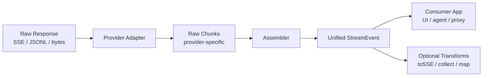

# llm-stream-assemble — Product & Technical Proposal

**Status:** Draft  
**Version:** 0.1 (planned)  
**Last updated:** 2026-05-25

---

## Summary

`llm-stream-assemble` is a small, provider-agnostic npm library that **assembles and normalizes LLM streaming responses** into a unified event format.

It sits between raw provider streams (SSE / JSONL / bytes from OpenAI, Anthropic, and OpenAI-compatible APIs) and application code (UI, agents, proxies). It does **not** make HTTP requests, execute tools, manage conversation memory, or ship UI components.

**Positioning:**

> *The missing stream assembly layer between LLM providers and your app.*

**One-line flow:**

```
raw provider stream → adapter → assembler → unified StreamEvent stream
```

---

## Problem

Teams building chat, agents, or voice pipelines repeatedly implement the same glue code:

1. **SSE / JSONL parsing** — each provider formats streams differently
2. **Text delta accumulation** — partial tokens must be stitched into complete messages
3. **Tool-call argument assembly** — function arguments arrive as fragmented JSON over many chunks
4. **Reasoning vs. content separation** — thinking blocks (Claude, DeepSeek R1, OpenAI reasoning models) must not leak into user-visible output
5. **Provider error handling** — malformed or mid-stream error payloads need graceful recovery
6. **Stream lifecycle** — abort, incomplete responses, and terminal finish reasons must be handled consistently

Existing solutions (LangChain, Vercel AI SDK, `@node-llm/core`, etc.) address this inside **large frameworks**. Many teams only need the stream normalization primitive and prefer to keep their own fetch layer, agent loop, and persistence.

---

## Solution

A focused TypeScript library with a single responsibility:

| In scope | Out of scope |
| -------- | ------------ |
| Parse provider-specific stream chunks | HTTP client, auth, retries |
| Assemble text, tool calls, reasoning | Agent loop, tool execution |
| Emit unified `StreamEvent`s | Memory / persistence |
| Partial JSON for live tool-arg preview | Billing, telemetry |
| Provider adapters (pluggable) | React hooks, UI components |

### Target users

- Backend teams proxying LLM streams to a frontend
- Agent builders who want a thin stream layer on top of plain `fetch()`
- Anyone switching providers without rewriting SSE parsers

### Differentiation

| Existing approach | Gap |
| ----------------- | --- |
| LangChain / AI SDK | Full stack; hard to extract only stream assembly |
| Provider SDKs | Vendor-specific; no unified event model |
| `@tashiscool/stream` | Broader scope (mux, cursors); less known |

`llm-stream-assemble` should be the **primitive**: zero/low dependency, tree-shakeable, golden-file testable, usable with `fetch()` alone.

---

## Architecture



### Layers

| Layer | Responsibility |
| ----- | -------------- |
| **Core** | Event types, `assembleStream()`, SSE parser, partial JSON, assembler state machine |
| **Adapters** | Map one provider's JSON payloads → internal raw chunks |
| **Assemblers** | Accumulate deltas into complete text, tool args, reasoning blocks |
| **Transforms** (later) | `toSSE()`, `collectStream()`, AI SDK compatibility mappers |

### Pipeline

```
ReadableStream<Uint8Array>
  → parseSSE()            // bytes → SSE data payloads
  → adapter.parseChunk()  // provider JSON → RawChunk[]
  → assembler             // RawChunk[] → StreamEvent
```

Adapters parse provider JSON into raw chunks. They do **not** assemble final messages or complete tool arguments. Cross-chunk accumulation lives in core. Adapters may keep minimal parse context (e.g. current content block index) when required by the provider format.

### Repository layout (v0.1)

Single npm package; split into a monorepo only if adapters grow significantly.

```
llm-stream-assemble/
├── src/
│   ├── index.ts
│   ├── core/
│   └── adapters/
│       ├── openai-chat.ts
│       ├── openai-responses.ts   # optional v0.1
│       └── anthropic.ts
├── test/
│   └── fixtures/                 # .sse dumps, no API keys
├── examples/
│   ├── node-fetch/
│   └── express-proxy/
├── docs/
│   └── proposal.md               # this file
└── README.md
```

---

## Unified Event Model

All providers normalize to the same `StreamEvent` union:

```ts
type StreamEvent =
  | { type: "message.start"; id?: string }
  | { type: "text.delta"; text: string }
  | { type: "text.done"; text: string }
  | { type: "reasoning.delta"; text: string }
  | { type: "reasoning.done"; text: string }
  | { type: "tool_call.start"; id: string; name: string; index?: number }
  | { type: "tool_call.args.delta"; id: string; delta: string; partial?: unknown }
  | { type: "tool_call.done"; id: string; name: string; args: unknown }
  | { type: "usage"; inputTokens?: number; outputTokens?: number; raw?: unknown }
  | { type: "finish"; reason: "stop" | "tool_calls" | "length" | "error" }
  | { type: "error"; error: Error; recoverable?: boolean };
```

### Event ordering contract

For each logical unit, consumers can rely on:

- **Text:** `text.delta` (zero or more) → `text.done`
- **Reasoning:** `reasoning.delta` (zero or more) → `reasoning.done`
- **Tool call:** `tool_call.start` → `tool_call.args.delta` (zero or more) → `tool_call.done`
- **Stream:** exactly one terminal `finish` event, then iteration ends

### Design notes

- `tool_call.args.delta.partial` is best-effort live preview; may be invalid JSON (especially Anthropic fine-grained streaming).
- OpenAI may send tool calls keyed by `index` before `id` arrives; the assembler reconciles by index until a stable id is known.
- `usage` for OpenAI Chat Completions requires `stream_options: { include_usage: true }` on the request (documented in README, not enforced by the library).

---

## Public API (v0.1)

### Core

```ts
function assembleStream(
  source: ReadableStream<Uint8Array> | AsyncIterable<string>,
  adapter: StreamAdapter,
  options?: { recoverMalformed?: boolean }
): AsyncIterable<StreamEvent>;

function assembleFromPayloads(
  payloads: AsyncIterable<string>,
  adapter: StreamAdapter,
  options?: { recoverMalformed?: boolean }
): AsyncIterable<StreamEvent>;

function parseSSE(
  source: ReadableStream<Uint8Array> | AsyncIterable<string>
): AsyncIterable<string>;

function parsePartialJSON(input: string): {
  value?: unknown;
  complete: boolean;
};

interface StreamAdapter {
  parseChunk(raw: string): RawChunk[];
}
```

### Adapters (exported factories)

```ts
openaiChatAdapter(): StreamAdapter;
anthropicAdapter(): StreamAdapter;
openaiResponsesAdapter(): StreamAdapter;  // optional v0.1
```

### Example usage

```ts
import { assembleStream, openaiChatAdapter } from "llm-stream-assemble";

const response = await fetch("https://api.openai.com/v1/chat/completions", {
  method: "POST",
  headers: {
    Authorization: `Bearer ${process.env.OPENAI_API_KEY}`,
    "Content-Type": "application/json",
  },
  body: JSON.stringify({
    model: "gpt-4o",
    messages,
    tools,
    stream: true,
    stream_options: { include_usage: true },
  }),
});

for await (const event of assembleStream(response.body!, openaiChatAdapter())) {
  switch (event.type) {
    case "text.delta":
      process.stdout.write(event.text);
      break;
    case "tool_call.args.delta":
      updateToolUI(event.id, event.delta);
      break;
    case "tool_call.done":
      await executeTool(event.name, event.args);
      break;
  }
}
```

---

## Provider Adapters

### OpenAI Chat Completions (required, v0.1)

Handle:

- `choices[].delta.content`
- `choices[].delta.tool_calls[]` — `index`, `id`, `function.name`, `function.arguments`
- `finish_reason`
- `usage` on final chunk when `stream_options.include_usage` is set
- Provider `error` objects in SSE payloads

### Anthropic Messages (required, v0.1)

Handle:

- `message_start` / `message_delta` / `message_stop`
- `content_block_start` / `content_block_delta` / `content_block_stop`
- `tool_use` blocks → `tool_call.*` events
- `thinking` / extended thinking → `reasoning.*` events
- Provider `error` event type

Fine-grained tool input streaming (document in README):

- **Current API:** `eager_input_streaming: true` on tools when `stream: true`
- **Legacy / Bedrock:** beta header `anthropic-beta: fine-grained-tool-streaming-2025-05-14` or `anthropic_beta` array
- Partial tool input may be **invalid JSON** until complete — core must tolerate this

### OpenAI Responses API (optional, v0.1)

Handle:

- `response.output_item.added`
- `response.function_call_arguments.delta`
- `response.function_call_arguments.done`

Defer to v0.2 if time-constrained.

### OpenAI-compatible generic adapter (recommended, v0.2)

A single adapter for OpenRouter, Groq, Together, local servers, and other APIs that copy the OpenAI Chat Completions SSE shape. Covers a large share of integrations without per-vendor code.

---

## Recommended Additions

These are not all required for v0.1 but strongly recommended for adoption and completeness.

### 1. `toSSE()` transform (v0.1 lite or early v0.2)

Reverse direction: unified `StreamEvent` → SSE for Express proxies and browser clients. This is the most common second step after assembly and makes the library immediately useful in full-stack setups.

### 2. `collectStream()` helper (v0.1 or v0.2)

Collect an event stream into a plain result object:

```ts
{ text, toolCalls, reasoning, usage, finishReason }
```

Many backends do not stream to UI — they only need the assembled outcome. This helper avoids every consumer reimplementing the same reducer.

### 3. AbortSignal / stream cancellation (v0.1)

When the caller aborts via `AbortController`, the assembler should stop cleanly without hanging. Emit a terminal event (e.g. `finish: { reason: "error" }` or a dedicated `aborted` variant) and release resources.

### 4. Generic OpenAI-compatible adapter (v0.2)

One adapter for all OpenAI-shaped providers. High leverage, low maintenance.

### 5. AI SDK interoperability (v0.2)

Optional mapper or documented compatibility with Vercel AI SDK / `@ai-sdk/provider` stream shapes. Lowers migration friction for teams already on AI SDK on the frontend without turning this library into a framework.

---

## Roadmap

### v0.1 — Foundation

**Goal:** Ship a usable, well-tested single package.

| Area | Deliverable |
| ---- | ----------- |
| Core | SSE parser, text/tool/reasoning assemblers, partial JSON, `assembleStream` |
| Adapters | OpenAI Chat, Anthropic Messages |
| Optional | OpenAI Responses adapter |
| Examples | `node-fetch` CLI, `express-proxy` |
| Docs | README (install, quickstart, non-goals, provider notes) |
| Quality | Fixture-based unit + golden tests; CI on push/PR |

**Non-goals for v0.1:** agent loop, fetch wrapper, memory, multiplex, Gemini/Bedrock adapters.

**Estimated effort:** 5–7 days part-time.

### v0.2 — Ecosystem

- Generic OpenAI-compatible adapter
- `toSSE()`, `collectStream()`, optional multiplex
- Gemini adapter
- Stream resume / cursor support
- AI SDK compatibility mapper
- Browser bundle size audit
- Split into monorepo packages if adapter count warrants it

---

## Testing Strategy

### Principles

- **Fixtures over live API in CI** — checked-in `.sse` dumps; never commit API keys
- **Golden tests** — raw fixture in → expected `StreamEvent[]` out; clear diffs when providers change
- **Live tests optional** — gated behind `OPENAI_API_KEY` / `ANTHROPIC_API_KEY`, run locally or in a secrets-enabled CI job

### Coverage areas

| Area | Examples |
| ---- | -------- |
| SSE parser | Multi-line `data:`, `[DONE]`, chunk split mid-line |
| Text assembler | Unicode, empty deltas, delta → done |
| Tool assembler | Parallel tools, 50+ arg chunks, index → id reconciliation |
| Partial JSON | Incomplete strings, nested objects, invalid Anthropic fragments |
| Error handling | Malformed JSON with `recoverMalformed: true` |
| Adapters | Provider-specific golden fixtures per adapter |

### Manual QA

- Stream text without dropped characters
- Assemble large tool args (10k+ chars)
- Abort mid-stream → no hang
- Node 18, 20, 22

---

## Tooling

| Tool | Purpose |
| ---- | ------- |
| TypeScript 5.x | Implementation + types |
| tsup | ESM + CJS + `.d.ts` |
| Vitest | Unit + golden tests |
| ESLint + Prettier | Lint / format |
| pnpm | Package management |

### Package metadata (v0.1)

```json
{
  "name": "llm-stream-assemble",
  "version": "0.1.0",
  "type": "module",
  "engines": { "node": ">=18" },
  "sideEffects": false,
  "license": "MIT"
}
```

**npm name:** `llm-stream-assemble` — available on npm as of 2026-05-25.

**Runtime target:** Node 18+ first. Browser support if APIs stay limited to `ReadableStream` / `AsyncIterable` (document compatibility explicitly).

---

## Publishing Plan

Publish only when explicitly requested. Before first release:

1. All fixture-based tests green
2. README with install, quickstart, supported providers, non-goals
3. CHANGELOG (Keep a Changelog format)
4. MIT LICENSE
5. `files: ["dist"]`, correct `exports` map
6. Core bundle target: **< 5 KB gzip**

**First version:** `0.1.0`  
**Post-release:** Git tag, GitHub Release notes, monitor issues for missing adapters.

---

## Decisions

| # | Decision | Choice | Rationale |
| - | -------- | ------ | --------- |
| 1 | Package structure | Single package for v0.1 | Faster to ship; split at v0.2 if needed |
| 2 | v0.1 adapters | OpenAI Chat + Anthropic required | Covers the two dominant APIs |
| 3 | Responses API | Optional in v0.1 | Newer API; defer if time-constrained |
| 4 | Runtime | Node 18+ first | Matches `ReadableStream` availability |
| 5 | npm name | `llm-stream-assemble` | Available, descriptive |
| 6 | License | MIT | Standard for OSS npm libraries |
| 7 | CI live tests | Fixtures only by default | No secrets required for contributors |

Record any changes to these decisions in README when implementation starts.

---

## Risks & Mitigations

| Risk | Mitigation |
| ---- | ---------- |
| Provider changes SSE format | Golden tests; semver minor for adapter fixes |
| Competing libraries absorb this niche | Clear positioning as primitive, not framework |
| Anthropic partial JSON is invalid mid-stream | Best-effort `parsePartialJSON`; document limitations |
| OpenAI tool `id` arrives late | Index-based reconciliation until id is known |
| Scope creep (agent loop, retry, memory) | Non-goals section in README; strict reviews |
| npm name squatted before publish | Register early or use scoped fallback |

---

## Success Criteria (v0.1)

1. A developer can stream OpenAI Chat Completions through `assembleStream` and receive unified events in under 10 lines of integration code (excluding fetch auth).
2. Streaming tool-call arguments assemble correctly for multi-tool responses on both OpenAI and Anthropic fixtures.
3. All fixture-based tests pass in CI without API keys.
4. At least one runnable example (`examples/node-fetch`) demonstrates text + tool assembly.
5. README clearly states what the library does **not** do.

---

## Next Steps

1. Review and finalize this proposal
2. Create implementation prompts incrementally (separate from this document)
3. Scaffold project (TypeScript, tsup, Vitest, CI)
4. Implement core + OpenAI Chat adapter
5. Implement Anthropic adapter
6. Examples, docs, publish prep
